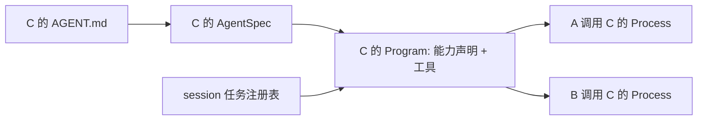

## Problem

为配置 agent 的人统一工具与运行时能力的声明方式，让根 agent、子 agent 和共享子 agent 都通过自身配置确定可用工具及能力，详见[需求文档](../requirement/agent-capabilities.md)。

## Scope

In:

- 根与子 agent 统一默认启用全部普通工具、`background` 和 `ptc`，显式配置各自覆盖默认值。
- capabilities 的解析、工具构建、模型可见入口及执行校验；相关测试、配置示例和 prompt 更新。

Out:

- 沿调用链继承配置、第三方 capability 注册机制、动态修改 agent 配置、前端配置界面。
- 调整 PTC 支持的宿主工具集合、subagents 调用拓扑，以及后台任务的持久化、通知、取消和重启语义。

## Validation Findings

设计阶段通过读取代码与现有测试确认以下行为，未修改 Rust 代码或运行构建测试。

| 核对项 | 证据 | 对设计的影响 |
| --- | --- | --- |
| agent 定义是否依赖调用者 | `coda_agent/src/spec.rs` 每个 spec 构建一份 Program；`runtime/invocation.rs` 按父 pid 派生子进程 | 保留共享 Program，能力无需跟随调用链或进程状态复制 |
| 工具默认值与选择 | `coda_server/src/agents.rs` 为根使用 All、子使用 Empty，再应用 exclude | 统一工具默认值只需调整配置解析层，运行时继续使用已解析的工具集合 |
| background 缺少资源时的 shell 行为 | `coda_tools/src/shell.rs` 忽略后台标记后按前台运行；`shell_tests.rs` 明确测试该行为 | 必须改成执行前报错，并用无副作用测试替换原测试 |
| PTC 的入口与恢复 | `runtime/driver.rs` 根据 runner 名称生成入口，discovery 独立分发；调用快照可跨审批与 checkpoint 保存 | 显式检查当前 Program 的 ptc 能力，旧快照不能重新开启已关闭能力 |
| 能力工具与子 agent 的名称冲突 | `AgentTeam::new` 只对普通工具检查保留名；`SubAgents::get` 接受裸名称，driver 优先匹配子 agent | 保留名校验必须覆盖 Rust 构建路径中的子 agent 定义和引用，否则能力工具调用可能被错误解析为委派 |

## Load-Bearing Decisions

1. **每个 agent 独立配置。** 普通工具与 capabilities 的默认值对根、子 agent 一致；C 的配置与调用它的 A、B 无关。调用拓扑和进程状态隔离继续使用现有机制。
2. **声明与实际可用条件分开。** Program 保存已解析的能力声明；background 还需要 session 资源，后台委派还需要实际根进程身份，PTC 还需要当前可调用的宿主工具。能力不会绕过审批或这些运行条件。
3. **能力控制完整的入口集合。** `run_javascript`、`list_javascript_tools`、`task_output`、`task_kill` 均为运行时管理的保留工具名，不属于普通工具注册表，也禁止用于子 agent 名称；保留规则与能力是否启用无关。普通工具选择先完成，再按能力构建配套工具。
4. **执行入口负责最终校验。** schema 用于告诉模型如何调用；shell、后台委派和 PTC 分别在其执行入口校验，恢复中的调用也经过这些入口。
5. **能力配置在加载时确定。** 继续沿用 AGENT.md frontmatter 需重启生效的规则，不增加持久化字段或热切换状态；重新打开 session 时，待执行调用受新 Program 的配置约束。

## Alternatives Considered

| 决策 | 备选方案 | 取舍 |
| --- | --- | --- |
| 默认配置 | 按实际调用者继承工具与能力 | 可让子 agent 自动跟随父配置，但共享 C 会有多套有效配置，需要改变工具构建与共享方式；采用独立默认值，接受父 agent 的排除规则不会传递给 C |
| 能力如何表达 | 加载时只展开为工具，运行时根据工具名称推断能力 | 少一个字段，但后台委派资格及 PTC discovery 仍需特殊判断；采用显式 Capabilities 值，让运行条件直接依赖声明 |
| 如何组织能力实现 | 引入 capability trait、插件注册表及统一执行钩子 | 适合第三方扩展；目前只有两项内置能力，采用现有 AgentTeam 构建点和各执行入口，避免引入通用扩展框架 |

## Configuration Contract

| 配置 | 根 agent 与子 agent 的一致行为 |
| --- | --- |
| 省略 capabilities | 启用全部已支持能力，当前为 background、ptc |
| `capabilities: [ptc]` | 只启用 ptc |
| `capabilities: []` | 关闭全部能力 |
| 省略 tools 或 include | 选择全部可声明普通工具，包括已注册的 ask_user、MCP 工具，然后应用 exclude |
| 显式工具列表或 include | 从普通工具注册表选择指定集合，然后应用 exclude |
| `tools: []` 或 `include: []` | 普通工具为空；capabilities 与 subagents 仍按自身配置生效 |

capabilities 接受小写名称列表；未知名称、错误类型和显式 null 报配置错误，重复名称按集合去重。显式列表完整替换默认值，未来增加的内置能力也进入省略声明时的默认集合。

tools 的列表简写、前缀匹配、去重、exclude 优先级、未知名称错误及空匹配警告保持现有规则。模式仅匹配普通注册表；例如 `run_*` 不会选中 run_javascript。精确写入上述四个保留工具名时，无论 include 还是 exclude，都报错并提示通过 capabilities 配置。

子 agent 的裸名称也不能使用这四个保留名。此规则由 AgentTeam::new 保证，直接传入 Rust AgentSpec 同样受约束；禁止冲突名称时应提示重命名子 agent，不能通过关闭 capability 使该名称合法。

例如只保留文件读取与 PTC 的专用子 agent，可使用以下 frontmatter 字段：

```yaml
capabilities: [ptc]
tools: [read_file, ls]
```

## Components

| 位置 | 职责与改动 |
| --- | --- |
| `crates/coda_agent/src/capabilities.rs`（新增） | 定义闭合的 Capability 枚举和 Capabilities 集合，集中处理默认集合、成员查询与列表反序列化 |
| `app/coda_server/src/agents.rs` | 根、子 frontmatter 解析同一种 Capabilities；统一普通工具默认值，校验保留工具名，将解析结果传给 AgentSpec |
| `crates/coda_agent/src/spec.rs`、`program.rs` | AgentSpec 和 Program 各携带不可变 Capabilities；统一校验普通工具与子 agent 的保留名，在现有 build 流程按能力注入工具和提供 background 资源 |
| `crates/coda_tools/src/spec.rs`、`lib.rs`、`shell.rs` | 普通注册表移出 run_javascript，统一保留名；保留现有工具工厂，shell 拒绝无法执行的后台请求 |
| `crates/coda_agent/src/runtime/driver.rs`、`groups.rs` | 根据当前 Program、资源及进程身份生成入口，并在实际调用时校验后台委派与 PTC |
| `app/coda_server/src/bin/server.rs` | 将根 agent 的 capabilities 与其他已解析配置一同传入构建流程 |

coda_execution 的 session 任务注册表、coda_ptc 的 JavaScript 引擎及宿主工具集合继续复用；不增加新的共享可变状态。

## Interfaces

以下为新增或调整的接口约定，其他工具执行接口沿用现有签名。

```rust
// coda_agent：定义支持的能力；Capabilities 是只含合法枚举值的集合。
pub enum Capability { Background, Ptc }
pub struct Capabilities { /* private set */ }

impl Capabilities {
    pub fn all() -> Self;
    pub fn none() -> Self;
    pub fn contains(&self, capability: Capability) -> bool;
}
// Default 等同 all；FromIterator<Capability> 构造显式集合，空输入为空集合。
// Deserialize 接受名称列表，未知名称或非列表输入失败，重复项去重。
```

`Capabilities` 使用枚举集合即可，不引入位标志依赖；仅枚举定义及 all 的固定清单列举支持项。AgentSpec 与 Program 新增 `pub capabilities: Capabilities`。前者保存构建输入，后者保存 session 内共享的声明；下游无需处理“缺省”的第三种状态。

```rust
// 根据已解析配置构建经过验证的团队；普通工具名或团队关系无效时返回 LoadError。
// root 集中携带根 agent 配置，替代原有 root_tools、root_subagents 两个参数。
pub fn build_agent_team(
    root_workspace: &str,
    root_base: SharedSystemPrompt,
    knowledge: &HashMap<String, WorkspaceKnowledge>,
    agent_workspaces: &HashMap<String, String>,
    registry: &ToolRegistry,
    files: Vec<AgentFile>,
    root: &RootAgentFile,
) -> Result<AgentTeam, LoadError>;

// ProcessRuntime 内部：检查调用者发起后台委派的资格，失败给出原因；不创建任务。
// 模型入口生成和实际后台任务接纳共用此检查；工具审批仍走原有流程。
fn check_background_subagent(&self, caller: &ProcessId) -> Result<(), String>;
```

配置与外部数据进入系统的边界：

- **AGENT.md：** Frontmatter、RootFrontmatter 的 capabilities 使用 `#[serde(default)] Capabilities`；RootAgentFile 的 Default 同样启用全部能力。此处拒绝未知 capability 和错误形状，并将错误附上 agent 名称。
- **工具注册与选择：** `ToolRegistry::insert` 拒绝四个运行时保留名，工具选择拒绝精确引用它们；`AgentTeam::new` 继续拒绝声明这些名称的普通 ToolSpec。各处共用扩展后的 `SYNTHETIC_RESERVED_TOOL_NAMES`。
- **子 agent 定义与引用：** `AgentTeam::new` 在工具构建和不可达节点裁剪前，检查传入的子 agent 定义名称及每个 AgentSpec.subagents 的裸目标名，拒绝上述四个保留名，返回新增的 `BuildError::ReservedSubagentName { name: String }`。检查覆盖根和深层调用方，与 capabilities、普通工具集合及后台资源无关。文件解析层的名称语法校验不能替代此边界，Rust AgentSpec 路径也必须成立。
- **模型调用与恢复：** 参数、当前能力和调用快照在执行入口校验。checkpoint 的 PTC 快照仅限制可调用范围，不构成开启 PTC 的依据。

子 agent 分发继续接受现有裸名称及 agent__ 前缀，不调整分发优先级；构建边界保证能力工具名不会落入子 agent 分支。

普通工具的统一缺省值在文件配置解析层落实：移除 DefaultToolSet 的根/子分支，resolve_tools 省略 include 时统一使用 registry.all_names()。Rust AgentSpec.tools 仍是显式的已解析 Vec；空 Vec 表示没有普通工具，程序化调用方按需传入工厂集合。

## Data Model and Execution



图中的 Program 表示共享的 C 定义；A、B 对应的进程状态仍独立。配置不保存在 Process、checkpoint 或数据库中。SessionHub/Session 对 BackgroundTasks 的所有权与关闭时机保持现状。

**构建顺序：**

1. 从文件解析 capabilities 与普通 tools；AgentTeam::new 统一校验普通工具、子 agent 定义及引用的保留名和团队拓扑，再允许构建。每个 agent 只解析自己的配置，Rust 构建路径经过相同的团队校验。
2. AgentTeam::build 为每个 spec 构建一次 Program，并复制能力声明。
3. 构建该 agent 的 BuildContext：仅当其启用 background 且 session 有注册表时，background 为 Some；其他上下文如 workspace、共享文件锁保持原样。
4. 构建普通工具；用该 BuildContext.background 调用现有 background_specs 注入 task_output、task_kill；声明 ptc 时注入 RunJavaScriptToolSpec。后者保留为跨 crate 使用的运行时工厂，但从 builtin_specs/spec_by_name 移出。
5. 子 agent 委派目标照常来自 subagents 字段，不通过 tools 或 capabilities 自动增加。

`Program.tools` 可以保存已构建的 run_javascript，而模型请求中是否提供它仍取决于本轮 PTC 条件；list_javascript_tools 保持现有动态合成方式，二者一起出现或隐藏。

| 入口 | 模型可见条件 | 执行校验 |
| --- | --- | --- |
| task_output、task_kill | 本 agent 启用 background，session 注册表可用 | 未构建则按不可用工具拒绝；已构建工具继续走原有审批和任务访问规则 |
| shell 后台参数 | 具有 shell，且 BuildContext 提供 background 注册表 | `run_in_background: true` 但缺少注册表时返回 ExecutionError，启动任何进程前结束；false 或省略仍正常前台运行 |
| agent__* 后台参数 | 调用者为实际根进程、其 Program 启用 background、session 注册表可用 | dispatch_background 在创建任务或返回已存在任务前调用共用检查，依据调用者而非被调用 agent 的能力 |
| 两个 PTC 入口 | 本 agent 启用 ptc，且本轮存在审批允许的合格宿主工具、快照元数据符合现有限额 | 两个入口都检查当前 Program.capabilities 是否包含 Ptc，以及调用携带的生成时快照，再按现有规则求快照、当前工具、固定 PTC 集合与当前审批策略的交集 |

后台委派检查从调用者 pid 对应的活动执行取得 Program，缺失活动调用者、非根、未启用能力或无注册表时拒绝；driver 中原有根身份的重复执行检查由该共用检查取代，生成 schema 时使用其结果。

PTC 的生成逻辑改读 Program.capabilities，不再通过 runner 工具名推断是否配置了能力。关闭 ptc 时，即使持有旧快照或伪造 discovery 调用，也返回 PTC_UNAVAILABLE；缺少快照同样拒绝。当前审批变化仍只能收紧旧快照的可用范围，历史允许列表不会扩大。原有调用事件、工具结果和审批流程继续复用。

## Risks and Validation

- **入口隐藏与实际执行不一致：** 优先覆盖无能力但直接传后台参数、伪造 PTC 调用及恢复旧 PTC 快照的情况；用临时文件或计数工具证明拒绝后没有启动命令或宿主调用。
- **能力工具被裸名称子 agent 遮蔽：** 在 `spec_capabilities_tests.rs` 通过 Rust AgentSpec 构造同名子 agent，对四个保留名分别验证构建失败；覆盖 capabilities 全开和全关、普通工具为空、根直接引用、深层引用及未被引用的定义。以 run_javascript 子 agent 加启用 PTC 的父 agent 作为明确回归用例，并验证合法命名的共享子 agent 仍可构建；所有错误都应发生在工具工厂运行前。
- **无 background 的 agent 仍可能处在后台执行组：** 根可以将它作为后台任务调用；保持 ProcessGroup、ToolCallContext 的任务来源、取消和清理信息完整。只限制它自己创建后台工作的入口。
- **根关闭 background、子 agent 开启：** session 仍可保存任务、发送完成状态通知及供用户面板查看结果。根不会因此获得 task_output/task_kill；其 prompt 只在工具可用时指引读取结果，通知格式与投递规则保持原样。
- **默认工具范围扩大：** 旧子 agent 省略 tools 会获得全部普通工具（含 ask_user/MCP）；只写 exclude 也以全部工具为基础。检查现有配置和测试 fixture，专用 agent 显式列出所需工具；审批策略保持现状。
- **Rust 构建调用点改变：** 更新 AgentSpec/Program 字面量与 PTC 测试 fixture，工具为空的测试按意图显式关闭 capabilities。强制编译 pg-tests，防止 feature-gated 测试遗漏。

无需新增数据库迁移。服务重启后构建新 Program，原有后台中断清理照常执行；等待审批的旧工具调用恢复时按当前配置校验。SetModel 重建使用同一已加载团队，因此保留能力声明。

## Prompt and Documentation

- 更新默认 system-prompt.md、templates/agents/coding-agent.md 及受影响的工作区 agent body：PTC 与后台指引以入口实际可用为前提，保留根进程限制及任务生命周期规则。
- 使用简短条件措辞和当前工具 schema，不新增能力模板变量或另一套动态 prompt 拼装机制；提示 agent 不应假设子 agent 拥有与自己相同的工具。
- 更新 AGENTS.md、templates/agents/README.md 与 `.coda/agents/` 示例：记录统一默认值、完整覆盖和空列表语义，移除普通 tools 中的 run_javascript。四个配套工具只通过 capabilities 配置。

## Implementation Roadmap

- [x] **[最小执行链与风险验证]** 增加 Capabilities，贯通 AgentSpec、Program 和工具构建；移出能力工具名并在普通工具和子 agent 名称中统一保护，更新相关 Rust 构建调用点。接通后台委派共用检查、shell 拒绝和两个 PTC 执行检查。
   目的：先通过 Rust AgentSpec 验证保留名冲突在构建时被拒绝及最关键的关闭语义；用现有 harness 验证无副作用拒绝、根调用无 background 的子 agent、非根拒绝后台委派，以及旧快照无法开启已关闭 PTC。
- [x] **[文件配置集成]** 接通根/子文件 capabilities 解析、统一普通工具默认值、更新 build_agent_team 与服务端调用点。
   目的：让 AGENT.md 驱动第一步已验证的执行行为；验证省略、空列表、单项、重复项、非法输入、保留名和 include/exclude，以及 A/B 共享 C 时配置一致。
- [x] **[生命周期集成]** 补齐无注册表、混合能力团队、后台组取消/清理、根未开启 background 仍接收通知、SetModel 与恢复场景的回归验证。
   目的：证明 per-agent 开关不会误关闭 session 基础设施；复用现有后台和持久化 harness，不引入新运行时机制。
- [x] **[配置与提示词]** 迁移受影响的配置、文档和 prompt，更新 Rust 测试辅助构建器，使其能力选择明确。
   目的：真实配置和模型指引符合新行为；检查所有 run_javascript 工具声明及旧的子 agent 空默认说明。
- [x] **[最终检查]** 运行 cargo fmt 检查、`cargo clippy`、`cargo test`、`cargo check -p coda_server --features pg-tests --all-targets`。
   目的：验证完整工作区和 feature-gated 存储测试仍可构建；仅在需要执行存储集成验证且有临时数据库时，运行相应 pg-tests。


## Implementation Validation

- 配置、构建和执行检查已接通。新增测试覆盖根/子一致默认值、显式覆盖、非法输入、四个保留工具名、共享子 agent 的独立配置，以及能力与 session 资源的组合。
- PTC 的伪造入口和旧审批快照恢复用计数工具验证：关闭能力后两个入口均返回 `PTC_UNAVAILABLE`，宿主调用次数为零。shell 拒绝用标记文件证明命令未启动。
- 后台集成覆盖调用者能力、无注册表、关闭能力的目标、根关闭能力后接收子 agent 的 shell 完成通知。现有取消、审批和故障清理测试使用关闭能力的同步后代，验证执行组生命周期仍完整。
- SetModel 测试逐一验证全开、全关、仅 PTC、仅 background；通过重建前后的实际模型请求核对能力工具。
- 已更新默认 prompt、模板、tracked 示例，以及工作区忽略的 `.coda/agents/` 配置；普通工具声明中的 `run_javascript` 已移除。
- `cargo test` 通过；现有需要付费 OpenRouter 请求的测试按原有 `ignore` 跳过。`cargo check -p coda_server --features pg-tests --all-targets` 通过；未执行依赖真实数据库的 pg-tests。
- `cargo fmt --all -- --check`、`cargo clippy` 和 `git diff --check` 均通过。
