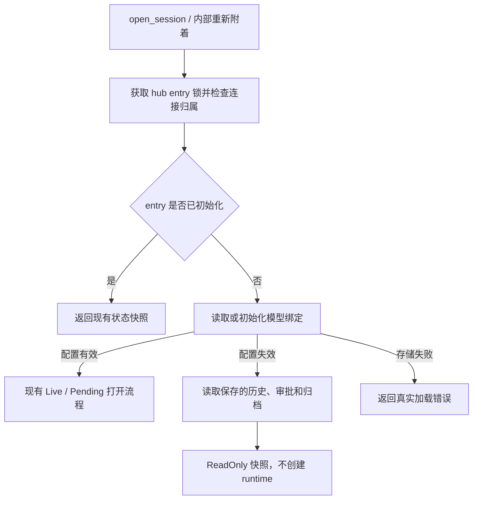

## Problem

历史会话的模型配置失效时，用户仍应能查看已保存的内容，同时不能继续执行或修改对话状态。需求见 [需求文档](../requirement/unavailable-model-readonly-session.md)。

## Scope

- 覆盖 provider/model 缺失、保存的 reasoning effort 不再受支持两种情况，提供只读历史、待审批内容和已保留的后台结果。
- 禁用续聊、审批、编辑重跑、压缩、分叉、模型设置和权限设置；保留重命名、删除和现有阅读功能。
- 不增加模型迁移、自动回退、API 故障探测或跨版本兼容层，不修改数据库 schema。

## Validation Findings

| 检查的问题 | 代码证据 | 对设计的影响 |
| --- | --- | --- |
| 历史为何无法加载 | `bin/server.rs::open_session` 在 `attach_core` 前校验持久化绑定，失败直接返回 `OPEN_FAILED` | 模型不可用应成为成功快照中的会话状态 |
| 能否复用普通打开流程 | `SessionBuilder::open` 会执行 `abort_scope`、筛掉已不存在的 agent 的审批，并 bootstrap runtime | 只读打开必须直接读取 storage，不能调用 runtime open |
| 能否复用历史读取函数 | `AppOpener::load_messages` 用 `.ok().flatten()` 将读取错误转为空历史 | 新读取接口必须返回 `Result`，不能将读失败当成空对话 |
| 后台恢复是否只读 | `BackgroundTasks::session_backed` 会持久化 Interrupted；`scan_inventory` 会删除未提交结果文件 | 后台历史需要独立的无写入读取接口 |
| 分叉是否需要先打开 | `SessionHub::fork` 支持冷会话，不经过 `command` | 除只读状态门禁外，冷分叉也必须检查原绑定 |
| 审批规则是否有旁路 | 前端通过 `resume.allow_patterns` 保存规则，但服务端还保留不带 session 的 `add_allow_pattern` RPC | 移除无现有前端调用的旧 RPC，规则写入保留在有效审批流程中 |
| 配置何时变化 | provider catalog 在服务端启动时构建，watcher 只刷新 workspace knowledge | 本次无需处理运行中会话因热更新突然变成只读；恢复配置后需要重启服务端再重连 |

服务端仍需满足现有启动条件：至少一个有效 provider/model，workspace 和 agent 配置能正常加载。本方案不让配置整体无效的服务端绕过启动校验。

## Alternatives Considered

| 选择 | 可取之处 | 取舍 |
| --- | --- | --- |
| 新增独立历史 RPC，不附着 hub | 历史读取与执行隔离直接，hub 改动少 | 前端需要两套打开/重连流程，还需另行处理接管、删除竞态、待审批展示和后台结果归属；本次不选 |
| `SessionHub` 增加 `ReadOnly` 状态（采用） | 共用快照、附着、接管和删除规则，命令限制有统一落点 | 必须检查所有 phase 分支，并提供不恢复 runtime 的数据读取方式 |
| 沿用 `Pending` 或创建禁止执行的 runtime | 可复用部分初始化逻辑 | `Pending` 的语义是可审批恢复；runtime 初始化已有清理和恢复副作用，难以保证只读；不选 |
| 给旧 `add_allow_pattern` RPC 补 session 参数 | 保留独立规则编辑接口 | 当前前端没有调用，且会形成第二条审批规则写入路径；移除旧 RPC 更直接，保留内部配置写入函数 |

## Components

- **AppOpener**：读取或初始化不可变模型绑定，依据启动时的 catalog 判定可用性，并提供持久化内容读取；不把 provider 实现交给 hub 判断。
- **SessionHub**：持有 `ReadOnly` 状态，统一负责附着、快照、命令拒绝、结果读取和释放；不新增平行的会话管理器。
- **coda_agent 的审批转换逻辑**：将持久化 checkpoint 转成 `PendingApproval`，供正常打开和只读读取共用，不构建 agent team 或 runtime。
- **coda_execution 的 ArchivedTasks**：以只读文件句柄列出归档并读取终态结果，复用路径校验、manifest 校验和 ring 读取，不注册任务或恢复执行。
- **Web store 与现有 UI**：保存服务端返回的只读状态，统一限制 actions；历史组件继续使用原消息类型和渲染逻辑。

## Data Model

新增服务端会话状态，随每次快照发送，不持久化：

```ts
type SessionAccess =
  | { type: "read_write" }
  | {
      type: "read_only";
      reason: "model_not_configured" | "reasoning_effort_not_supported";
    };
```

- `SnapshotPayload`、wire `Snapshot`、前端 `Snapshot` 都增加必填 `access`；`Live`、`Pending` 返回 `read_write`。它只说明模型配置是否允许使用会话，原有忙碌、审批、连接权限约束仍然适用。
- `SessionSummaryWire` 和前端 `WorkspaceSession` 同样携带 `access`，让列表在打开会话前也能禁用分叉。现有 `list_sessions` 查询多读取已有的 `model_binding` 列，catalog 使用与打开流程相同的纯判定函数；不逐条打开会话或增加逐条数据库查询。
- `EntryPhase::ReadOnly(ReadOnlyState)` 持有原 `SessionModelBinding`、原因、根线程历史、所有保存的待审批项，以及可选 `Arc<ArchivedTasks>` 和归档读取错误；不持有 `Session`。
- 只读状态的 `background`、notice watcher、pending notices 均不创建；`turn_running`、`compacting` 固定为 false。归档句柄随 entry 释放，不拥有子进程。
- 保留快照现有 `provider_id`（组合 selection key）和 `reasoning_effort` 字段；只读时返回原值，不归一化成默认配置。
- 快照增加可空的 `background_tasks_error`：归档不可读时主历史仍可展示，并有明确提示，不把错误静默当成没有后台任务。
- 前端 `OpenedSession.access` 在尚未收到打开结果时为 null；只有 draft 的本地设置及已确认 `read_write` 会话才允许进入相应操作流程。只读状态不写入 localStorage。

## Interfaces

以下是逻辑签名，省略现有 trait 的 boxed future 写法。

```rust
// SessionOpener：返回实际绑定及其可用性；存储故障仍是错误。
// initial 为 Some 时允许首次创建；None 只查询已有会话，缺失返回不存在。
async fn resolve_session_model(
    &self, key: &SessionKey, initial: Option<&ModelSelection>,
) -> Result<SessionModelResolution, OpenError>;

// SessionOpener：读取根历史及全部待审批项，不恢复执行、不写 checkpoint。
// 空历史是合法结果；任何存储读取/解码失败均向上传递。
async fn load_read_only_history(
    &self, key: &SessionKey,
) -> Result<ReadOnlyHistory, OpenError>;

// 审批转换：验证该 checkpoint 确实有非空待审批调用，保留持久化身份。
impl TryFrom<StoredCheckpoint> for PendingApproval;

// ArchivedTasks：只打开已存在的归档；目录不存在返回 None，损坏返回错误。
fn open_existing(path: &Path) -> Result<Option<ArchivedTasks>, ArchiveError>;
// 只枚举有界概览，不修复、清理或生成通知；不读取全部结果正文。
async fn overview(&self) -> Result<Vec<TaskSummary>, ArchiveError>;
// 保留现有 Unknown/Pending/Expired/Available 语义，不消费输出或通知。
async fn read_result(&self, id: &TaskId) -> Result<Option<TaskResult>, ArchiveError>;
```

`SessionModelResolution` 区分 `Available`（可执行 selection，沿用现有 effort 归一化）与 `Unavailable`（原始 binding + reason）。只读原因由服务端产生，不接受客户端指定。

信任边界：RPC 层校验 workspace、session id 和请求结构；hub 在 entry 锁内校验当前连接归属及状态，随后才允许命令产生副作用。归档边界继续校验 `TaskId`、目录/文件类型、属主、权限、manifest 和结果长度，使用 fd-relative、`O_NOFOLLOW` 操作，不引入普通路径拼接读取。

## Load-Bearing Decisions

### 1. 在 hub 的会话锁内选择正常打开或只读加载

将 `open_session` 当前位于 hub 外的 `initialize_session` 与绑定校验移到 `resolve_session_model`，由 hub 在首次 attach 的 entry 锁内调用。客户端选择只负责新会话的初始值；已有会话始终读取保存的绑定。同步移除 `AppOpener::open` 为旧竞态所做的重复初始化。



只读和正常状态共用附着事件流、`takeover`、`Evicted`、`close_session`、删除屏障；不会因为“只读”引入多客户端同时持有的新规则。断开后只读 entry 可立即释放，不能被未执行的历史任务或未消费通知留住。内部重新附着也走同一判定，缓存的 selection 不能覆盖 durable binding。

连接附着仍沿用清除未读完成标记的既有行为；这是阅读元数据，不改变历史、模型绑定、执行状态或待审批。恢复模型配置并重启后，新 entry 自然回到现有正常打开流程，无需修改数据库中的只读标记。

### 2. 读取待审批内容与执行恢复分开

`load_read_only_history` 使用现有 `SessionStorage` 的根 checkpoint 与 pending checkpoint 读取方法，错误必须传播；在 hub 锁内读取，避免与同一会话的删除/执行操作交错。不存在根 checkpoint 按现有空会话语义处理，不吞掉实际读取错误。

从现有 `collect_pending_approvals` 提取纯转换，保留 pid、agent_name、agent_path、task_id、parent_message_id、调用及 suspended_at。只读路径不按当前 agent 配置过滤，不运行 `abort_scope`，也不自动拒绝或批准。普通打开保留当前过滤和重启清理规则；恢复配置后的首次正常打开仍按这些规则处理旧后台执行。

### 3. 在所有副作用之前统一拒绝

`SessionHub::command` 在验证连接归属后、进入 `GetTaskResult` / `KillTask` / `Compact` 等提前分支前检查只读状态；只允许 `GetTaskResult`。其余返回 `CommandOutcome::ReadOnly(reason)`。RPC request 映射为新增 `SESSION_READ_ONLY = -32007`，携带原模型和原因；`abort`、`kill_task` notification 不执行、不回包，按协议记日志。

| 操作 | 只读行为 |
| --- | --- |
| task、resume、rewind、compact、set_model、set_permission_mode | 服务端明确拒绝；不保存用户消息、决定或允许规则 |
| abort、kill_task | 不产生副作用；前端无可用停止按钮 |
| fork_session | 拒绝；已加载来源在 phase 检查，冷来源在同一 entry 锁内用 `resolve_session_model(key, None)` 检查，不能顺便创建会话 |
| get_task_result | 从只读归档读取；释放锁做 I/O 后重新检查连接及 entry 身份，防止返回已被接管/删除的旧 entry 结果 |
| open/close、rename、delete、目录列表和历史查看 | 沿用现有规则；只读状态不改变这些操作的授权和删除确认交互 |

移除旧 `add_allow_pattern` RPC、wire 参数和前端协议声明；保留内部配置方法给 `resume` 使用。这样无 session 的规则写入不会绕过限制。

`task`/`rewind` 当前先通过 `provider_of` 检查图片能力，`set_model` 先校验目标配置：这些预检查需先识别只读，避免把只读会话误报成“不支持图片”或“无效模型”。扩展现有模型查询结果携带只读原因即可；最终副作用门禁仍在 hub 锁内，不依赖前置查询。请求结构非法和连接已失去归属仍使用原有错误。

### 4. 后台结果只读，不恢复后台任务

新增只打开现存目录的 `ArchiveDir` 入口；只读归档不调用 `open_or_create_root`、`scan_inventory`、`BackgroundTasks::session_backed`，不创建目录、改权限、回收配额、推进读取游标、修改 manifest 或确认通知。

`ArchivedTasks` 复用底层纯读取与校验，ring 文件以只读方式打开，概览数量和输出大小沿用现有上限。保存为终态的结果继续支持查看；Expired、损坏和未知 id 保留既有明确结果。

保存为 Running / WaitingApproval / Cancelling 的条目只展示最后保存状态，标注“未恢复”，`running=false`、`subtree_active=false`、`result_available=false`。不伪造 Interrupted 时间，也不将尚未提交的结果文件作为最终回答。直接读取此类任务时，RPC 返回现有 `TaskResultWire::Error`，说明“任务未恢复，尚无已提交的终态结果”，避免 UI 认为仍在等待执行完成。磁盘状态保持原样。

归档读取失败与主历史读取失败分开：前者通过 `background_tasks_error` 或结果面板提示，后者仍使打开失败。不会通过创建一个后台 registry 来掩盖结果访问问题。

### 5. 前端保留阅读界面，集中限制操作

- 正常返回快照，连接状态保持 connected；显示固定的只读原因提示和原 selection key。模型不在 catalog 时显示静态文本，不能退回默认模型或空白下拉框。
- `access` 经 solicited / pushed snapshot 使用同一 reducer；请求打开期间及重连尚未收到新快照时，已有会话的写操作不可用。
- actions 在入口检查可写状态，再做乐观更新或发送 RPC；覆盖 submit、审批草稿及提交、权限设置、模型设置、编辑、压缩、分叉、停止和附件输入。列表按钮与分叉 action 共用判定：当前会话以本次附着快照为准，非当前会话使用最新 catalog，不能优先使用历史缓存；重连时清空旧 catalog 的 access，等新 catalog 返回后再启用。服务端仍独立校验冷分叉，不能依赖客户端标记。
- composer 禁用编辑/发送、附件和相关命令，保留可复制的现有草稿。审批面板继续展示工具参数、问题与选项及翻页，禁用决定、输入、“始终允许”和提交。
- 只读快照以服务端历史为准，不能继续把未确认的乐观消息或压缩条目显示为运行中。断线导致 RPC 拒绝时，在清理乐观条目前将文本、图片和发送前最后一条用户消息的 id 保存为本地 `unconfirmedInput`；重连快照按该位置之后的文本及图片核对。已保存则清除待确认输入，未找到或位置已被删除则恢复为 `unsentDraft`。尚在压缩中的快照要等压缩结束再核对。这些状态只保留在内存，不自动重发，也不丢弃持久化待审批内容。
- 更新 `requestOpenAndApply` 的返回契约为 `SessionAccess | null`，首次发送等后续流程必须确认 read_write，不能把“打开成功”直接当作“可以发送”。
- 后台面板按快照展示归档状态，禁用停止；重命名、删除不复用“可执行”门禁，仍遵循原有连接和归属限制。

## Risks / Open Questions

- 最大风险是误用带恢复副作用的读取方法。先验证只读加载前后 checkpoint、绑定、审批、任务 manifest/输出文件和通知回执不变；阅读元数据清除及显式重命名/删除除外。
- hub 的状态分支和提前返回较多，最容易漏掉冷分叉、权限模式和后台停止。用真实 RPC 的覆盖表验证，不能只测试 composer 按钮。
- 不扩大为运行中动态降级；若将来支持 provider catalog 热更新，需要另行设计现存 runtime 与只读状态的转换。本次没有影响方案选择的待定问题。

## Implementation Roadmap

- [x] **无副作用读取** 提取 checkpoint→审批转换、实现归档只读入口和结果读取。验证含旧后台审批、已删除 agent、未提交结果、过期输出的样本，读取前后保存数据与文件内容不变。
- [x] **服务端状态** 在 hub 锁内解析绑定，增加 `ReadOnly`、纯历史读取及完整生命周期。验证缺模型/无效 effort 能打开；缺失读取与真正失败可区分；断开释放、接管和并发删除不遗留 entry 或启动 runtime。
- [x] **协议与限制** 增加快照 access、归档错误和只读错误码，覆盖命令/预检查/冷分叉，移除旧规则 RPC。通过 RPC 验证所有禁用操作无副作用，重命名、删除及终态结果读取可用。
- [x] **前端** 接入统一状态与 action 门禁，完成提示、原模型展示、审批只读和重连时的乐观状态处理。验证刷新、断线恢复、缺 catalog 模型、图片历史、审批翻页及草稿保留。
- [x] **回归** 覆盖配置恢复后的正常打开、新会话、普通 Pending 审批、可写会话分叉/删除和后台结果。更新受影响的协议/项目说明；本次只读路径不创建 agent，不改变 agent 可见运行规则，因此无需修改 system prompt 或 templates。

实现后的最终检查：`cargo clippy`、`cargo test`、`cargo check -p coda_server --features pg-tests --all-targets`、`pnpm --filter coda-web lint`、`pnpm --filter coda-web test`。持久化无写入用例加入 pg-tests，在独立测试数据库运行 storage_pg 和服务端 RPC 测试。


## Deviations from Design

- `resolve_session_model` 的初始化参数复用现有 `ModelSelection`，由 `AppOpener` 转成持久化绑定；已有会话仍以数据库中的绑定为准。
- PostgreSQL 无写入断言放在 `bin/server_tests/read_only.rs`，同时覆盖生产 RPC 和实际存储；CI 的数据库任务扩展为运行完整 `coda_server --features pg-tests`，包括原有 storage_pg。
- 补充仅在内存保留的 `unconfirmedInput`，在断线清理前保存待确认内容并用重连快照核对；原实现依赖快照到达时乐观条目仍在，真实断线顺序不满足这个前提。


## Verification

2026-09-12 完成：

- `cargo clippy`、`cargo test`、`cargo check -p coda_server --features pg-tests --all-targets` 均通过。
- 在本地独立 `coda_test` 数据库运行 `cargo test -p coda_server --features pg-tests`，服务端 268 项单元测试、15 项 binary 测试及 49 项 storage_pg 测试通过；其中 2 项新增 RPC 测试直接使用生产 dispatcher 和 PostgreSQL。
- RPC 回归比较执行数据及行版本，覆盖已移除 agent 的后台审批、全部受限命令、无回包通知、冷分叉、内部重新附着、重命名、删除，以及删除后正常创建新会话。
- 归档测试覆盖重复读取、未提交结果、损坏与过期输出、未知任务，以及缺失目录和符号链接；检查读取前后文件内容不变。
- `pnpm --filter coda-web lint`、`pnpm --filter coda-web typecheck`、`pnpm --filter coda-web test` 均通过，前端共 159 项测试。
- 前端回归覆盖只读与尚未取得快照时的 action 限制、待审批展示、原模型与失效 effort 展示、草稿保留和恢复可写状态。
- 评审后的定向测试先复现未确认输入丢失与非当前缓存会话分叉失效，再通过真实 RPC 客户端和可控 WebSocket 验证修复；覆盖已保存输入、历史重复文本、图片差异、历史位置删除、明确拒绝、压缩仍在执行，以及新 catalog 尚未返回时的分叉限制。

文档初始提交为 `17df9002`，实现位于分支 `fix/unavailable-model-readonly-session`。
