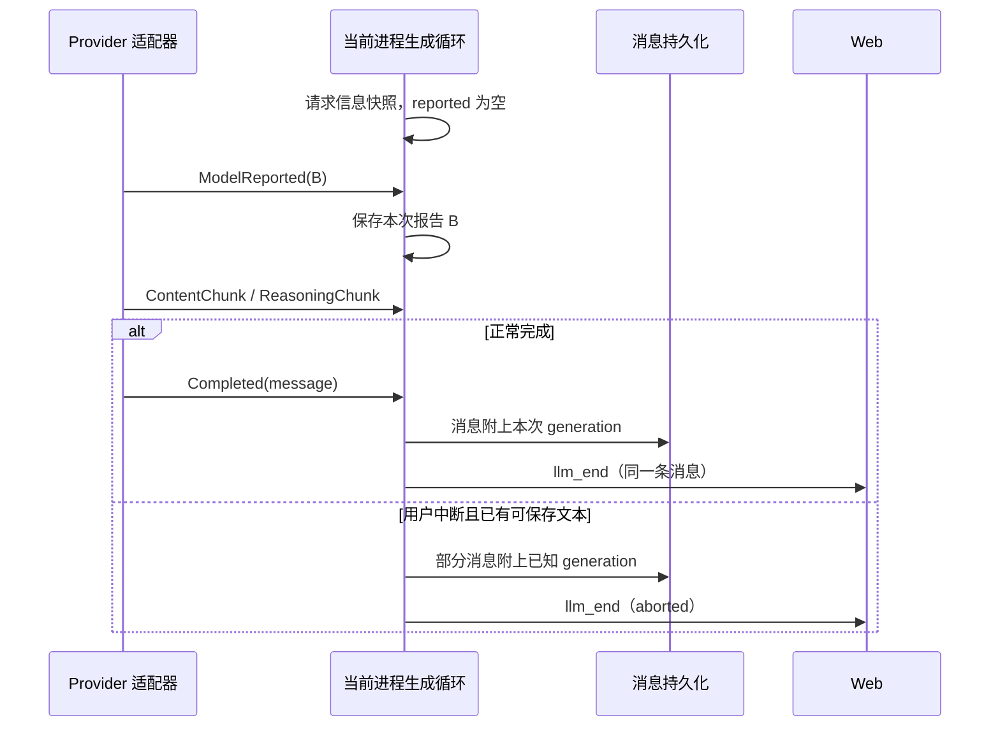

# Upstream Generation Model Design

## Problem and Scope

让消息记录并展示上游响应报告的模型，同时保留当次请求信息。对应[需求文档](../requirement/upstream-generation-model.md)。

本次只增加模型标识的采集和使用，不扩展为完整调用审计。记录单位是一次生成产生的 `AssistantMessage`，不是整个用户 turn，也不是所有 HTTP 尝试。一个 turn 中多次模型生成各自记录。

## Validation Findings

| 检查对象 | 结果 | 对设计的影响 |
| --- | --- | --- |
| [`GenerationMetadata`](../../crates/coda_core/src/llm.rs) | 只有 `provider_id`、请求的 `model_id` 和 `reasoning_effort` | 保留请求字段，增加来源明确的响应字段 |
| [`CompatibleStreamResponse` / `reduce_response`](../../crates/coda_openai/src/lib.rs) | BYOT 响应结构未声明 `model`；没有 choice 时直接返回空事件 | 在适配器采集顶层模型，且在空 choice 返回前保留模型事件 |
| [`driver` 生成循环](../../crates/coda_agent/src/runtime/driver.rs) | 请求前构造 generation，完成时写入消息；用户中断时另行构造部分消息 | 用流事件更新本次 generation，两条保存路径使用同一份数据 |
| `async-openai 0.40.2` 本地依赖源码 | BYOT 对每个 SSE data 按调用方提供的类型反序列化，`[DONE]` 单独处理 | 无需换 SDK 或自行实现 SSE 客户端；需要避免附加字段类型异常导致整帧反序列化失败 |
| [`storage`](../../app/coda_server/src/storage.rs) / [`wire`](../../app/coda_server/src/wire.rs) | 消息完整存入 `messages.payload` JSONB；`llm_end` 携带完整 assistant 消息 | 不增加数据库列、独立 metadata 表或新的前端通知类型 |
| [`EntryModel`](../../app/coda_web/src/components/transcript.tsx) / [`session` store](../../app/coda_web/src/store/session.ts) | 完成消息和历史重建都使用消息自身的 generation；标签目前读 `model_id` | 保留现有传输链，修改字段类型及标签取值 |

外部文档于 2026-09-13 核对，结论限于 API 公开语义：

- OpenRouter 明确说明 fallback 最终使用的模型出现在响应 `model` 中，证明请求与响应模型应分开保存。[Model Fallbacks](https://openrouter.ai/docs/guides/routing/model-fallbacks)
- Kimi 文档说明响应示例的模型名按请求参数返回，并给出流式 chunk 的 `model`。同名响应不足以证明底层版本已被解析。[Kimi Chat Completions](https://platform.kimi.ai/docs/api/chat)
- DeepSeek 的 Chat Completions 文档包含响应模型字段；本次只读取 API 返回值，不使用某一时点的产品版本表推导历史版本。[DeepSeek Chat Completions](https://api-docs.deepseek.com/api/create-chat-completion/)
- OpenRouter 的完整路由 metadata 需要 opt-in header，在流式响应中位于末尾 chunk，缓存命中时可能缺失。记录模型名本身无需接入这套协议。[Router Metadata](https://openrouter.ai/docs/guides/features/router-metadata)

本次没有运行真实模型调用。现有 OpenRouter fixtures 只保留 reasoning、工具和 usage 等片段，没有模型字段，不能当作该字段已被实测的证据。代码与 SDK 检查已足以确定采集路径；下面的本地 SSE 集成验证负责证明路径确实可用。

## Alternatives Considered

| 决策 | 采用 | 比较与取舍 |
| --- | --- | --- |
| 请求和响应的关系 | 增加 `reported_model_id`，保留现有 `model_id` 的请求语义 | 直接把 `model_id` 改成响应值最省字段，但会混淆旧记录、缺失响应和请求来源。统一重命名为 `requested_model_id` 更直观，但为本次需求引入了额外协议及持久化改名；保留原名并明确注释即可 |
| 上游信息的语义 | 始终叫 reported，不设 `actual` / `resolved` | 按厂商维护可信度或 resolved 字段需要长期维护映射规则，也无法从通用兼容接口验证底层版本；当前没有使用这种分类的业务需求 |
| 适配器到运行时 | 增加一个 `ModelReported` 流事件 | 只把字段放在最终 Completed 消息中更简单，但取消时最终消息不存在，运行时无法保存已收到的信息。事件满足现有中断语义 |
| 谁构造 generation | 继续由运行时统一构造 | 让适配器构造完整 generation 可以使 Completed 自带它，但会让请求 profile 的所有权分散，并增加事件与最终消息合并规则。选用事件作为上游模型的唯一输入，不新增完成结果包装类型 |
| 同一流报告多个值 | 最后一个有效值覆盖前一个 | 固定首值会漏掉后续更具体的报告；保存完整变化序列则扩展了数据和 UI。接受本次无法解释不同 chunk 之间模型变化原因的限制 |

## Data Model

建议保留平铺结构，只增加一个持久化字段：

```rust
pub struct GenerationMetadata {
    pub provider_id: String,
    pub model_id: String,
    pub reasoning_effort: Option<String>,
    #[serde(default, skip_serializing_if = "Option::is_none")]
    pub reported_model_id: Option<String>,
}
```

| 字段 | 含义与来源 |
| --- | --- |
| `provider_id` | 本次进程使用的 Coda 配置 provider ID，来自进程 profile；可能指向网关，不代表网关后的执行供应商 |
| `model_id` | 本次 `ChatCompletionRequest.model`，保留原始请求值 |
| `reasoning_effort` | 本次 Coda 请求参数；不表示上游最终实际执行的 effort，也不从响应模型推断或改写 |
| `reported_model_id` | 该流最后接收的有效顶层 `model` 字符串；`None` 表示没有记录到有效报告，不使用请求值填充 |

示意数据，模型名称仅为说明字段关系：

```json
{
  "provider_id": "gateway",
  "model_id": "chat-alias",
  "reasoning_effort": "high",
  "reported_model_id": "vendor/model-version"
}
```

`AssistantMessage.generation` 仍然可缺省。旧记录和合成消息原本没有的事实不作补写；旧 generation 缺少新增字段时自然得到 `None`。这是字段的未知值语义，不需要格式版本、迁移脚本或旧字段别名。

不保存 `display_model_id` 等可派生字段。上游字符串不做大小写转换、别名展开、日期解析、provider 前缀拆解或目录匹配；对有效字符串保留原值。

## Components and Interfaces

### `coda_openai`: Parse and Report the Upstream Model

在 `CompatibleStreamResponse` 中声明可选 `model`，使用字段级反序列化函数；下面是私有边界的建议签名：

```rust
// 上游信任边界：只接受至少有一个非空白字符的 JSON 字符串。
// 缺失、null、空白及其他 JSON 类型视为未提供，不影响其他字段的解析。
fn deserialize_reported_model<'de, D>(deserializer: D)
    -> Result<Option<String>, D::Error>
where
    D: serde::Deserializer<'de>;
```

该字段配合 `#[serde(default, deserialize_with = "deserialize_reported_model")]` 使用。实现可在此单字段上读取 `serde_json::Value` 再判断类型；不要将任意 JSON 序列化成模型名，也不要退回整个响应的无类型解析。结构损坏、正文或工具数据解析失败仍按现有错误规则处理。

`CompletionAccumulator` 增加私有 `reported_model_id: Option<String>`，仅记录最近有效值并抑制相同值的重复事件。它是该次 `stream()` 的局部状态，不放入可被多个进程共享的 `OpenAICompatible` 实例。

`ProviderKind::reduce_response` 的签名不变，所有现有 kind 使用相同的模型处理规则：

1. 先按现有规则检查 `response.error`，错误响应中的模型不作为成功报告消费。
2. 若有新的有效 `model`，更新 accumulator 并把 `ModelReported` 放入事件向量；与上次完全相同则不重复发出。
3. 处理 usage；没有 choice 时返回**已经积累的事件**，不能再返回新的空向量。
4. 按原逻辑处理 reasoning、正文和工具调用。同一 chunk 的模型事件排在其文本事件之前。

必须检查每个 chunk，不能只检查首帧、含正文的帧或含 usage 的帧。`model` 缺失、为空或无效时不清空之前的值。模型名称变化本身不触发生成错误或 Coda 重试。

### `coda_core`: Extend the Stream Event Interface

```rust
pub enum LLMStreamEvent {
    // 上游本次报告的有效模型名；新事件替换此前的报告。
    // 在其所属响应的内容事件之前、Completed 之前发出。
    ModelReported(String),
    ContentChunk(String),
    ReasoningChunk(String),
    Completed(Box<AssistantMessage>),
}
```

不改变 `LLMProvider::stream` 的请求和返回签名，也不新增回调、共享 cell 或 `AgentEvent`。适配器负责保证新事件满足上述有效字符串约定，运行时不重复做供应商级验证。

`ModelReported` 是 provider 向调用方传递报告值的唯一接口。`Completed` 继续承载适配器组装的消息，其 `generation` 仍为空，由正常生成循环补齐。直接调用 `LLMProvider::stream` 且需要模型信息的消费者必须读取新事件，不能期待适配器已经构造好完整 generation。测试 provider 未发出该事件时按未知处理，不得用 Completed 中自行填写的 generation 绕过这一约定。

### `coda_agent`: Collect and Persist Metadata per Generation

将现有请求前的 `generation` 改为局部可变值，新增字段初始化为 `None`。收到 `ModelReported(model)` 就更新 `generation.reported_model_id`，不向客户端单独广播。

完成与取消分支继续把这份 generation 写到各自构造的消息上。现有完成分支的整份赋值可以保留：此时赋入的已经是同时包含请求和响应信息的本次记录。



具体结束规则：

| 场景 | 保存规则 |
| --- | --- |
| 正常正文、reasoning 或仅工具调用完成 | 保存本次请求信息与最后收到的有效上游模型 |
| 上游一直没有有效 `model` | 正常保存消息，上游模型保持未知；无 usage 也一样 |
| 用户中断且已有正文或 reasoning | 沿用已有部分消息保存逻辑，附上取消前生成循环已消费的报告；它不宣称存在最终完整答案 |
| 只有模型事件，随后用户中断；或工具调用尚未完成且没有可保存文本 | 沿用现有行为，不为 metadata 单独造一条 assistant 消息 |
| HTTP 拒绝、流中报错、缺少 Completed 或进程崩溃 | 不扩展既有错误和恢复行为，不为失败调用新建审计记录；未随消息提交的 metadata 不承诺持久化 |

每次生成都新建局部值；同一 turn 的下一次生成、重试、root 和各子进程互不继承报告值。取消与事件同时就绪时沿用当前取消优先策略，只保存已经消费的事件，不为读取剩余 metadata 延迟取消。

自动/手动 compaction 和标题生成目前只消费最终内容，不生成这里的普通 assistant 历史记录；对应 `LLMStreamEvent` 的 match 显式忽略新事件。同步更新 smoke helper 和测试 provider 的穷尽匹配。

### Persistence, RPC, and Web

继续走 `AssistantMessage.generation` → `messages.payload` → 历史/snapshot/`llm_end`，新字段不写入会话 model binding。响应模型可以不在 catalog 中，也不能用它触发 family 或输入模态校验。

fork 随消息 payload 复制，rewind 保留或删除对应消息；既有 JSONB 路径无需专门 SQL。这里不改变 checkpoint 提交和事件送达的保证，也不逐 chunk 提交 metadata。

Web 的 `GenerationMetadata` 类型增加 `reported_model_id?: string | null`。`session` store 沿用消息 generation 的原样赋值；统一在 `EntryModel` 中处理所有现有模型标签：

| 消息记录 | 标签 | 悬停详情 |
| --- | --- | --- |
| 有上游模型 | 上游模型原值 | 分列“上游报告模型”“请求模型”“配置 provider”“请求 reasoning effort” |
| 有 generation、没有上游模型 | 请求模型，并显示“请求”来源标记 | 说明没有记录到上游模型，列出已有请求信息 |
| 完全没有 generation | 不显示模型标签 | 不从当前会话补造历史信息 |

文案按当前界面的英文风格落地，例如缺失时 `A (requested)`；有报告时详情使用 `Reported model` / `Requested model` / `Configured provider` / `Requested reasoning effort`。两种模型同名时仍保留来源，缺失时不要断言一定是上游没返回，也可能是旧消息未采集。

沿用当前 `llm_end` 后设置消息标签的时机。`llm_start.model` 继续表示请求模型，用于开始活动记录，不能当作上游报告。仅工具调用消息照常持久化 metadata，本次不为没有独立模型标签的工具条目增加展示入口。

## Risks and Limitations

- 兼容网关可能回显别名，也可能在不同 chunk 报告不同模型。本设计能忠实保留最后的有效报告，不能证明先前输出由哪个模型产生；这种逐段归因需要另一份审计设计。
- 直接使用 `Option<String>` 的默认反序列化会让数值、数组或对象类型的 `model` 破坏整个响应。第一步必须验证字段级容错和空 choice 帧的事件送达。
- 仅改前端显示或只改 Completed 都会遗漏采集或取消路径；验收必须贯穿实际适配器、生成循环和消息保存。
- 本次没有验证每家线上端点的具体返回值。设计不依赖厂商名单或固定模型 ID；本地集成测试证明字段能被保留，真实返回语义以该上游为准。

## Implementation Roadmap

- [ ] **[核心接口与适配器] 增加可选持久化字段、模型事件和响应字段解析。**
   目的：先验证最容易遗漏的实际流路径；在同一步更新所有穷尽 match，使工作区可编译。
   验证：本地 SSE stub 通过真实 `OpenAICompatible::stream` 发送“请求 A、首帧 B、正文、空 choices 尾帧 C、DONE”，确认 B/C 模型事件按序送达且消息内容正常。另测字段类型异常不会丢弃同帧正文。

- [ ] **[运行时] 生成循环消费新事件，完成与用户中断共用 generation。**
   目的：把报告绑定到产生消息的具体进程和具体生成。
   验证：正常结束、无 usage、仅工具调用、正文/仅 reasoning 后取消、收到 metadata 前取消，以及相邻生成报告隔离；root、继承和显式覆盖模型的子代理，并覆盖并行进程。

- [ ] **[消息存储与传输] 验证新增字段贯穿 checkpoint、历史和结束事件。**
   目的：历史显示有稳定的数据来源。
   验证：序列化往返、已有三字段 generation 和无 generation；PostgreSQL 保存/冷打开/fork/rewind；`llm_end` 与持久化消息一致。扩展既有 provider 消息编码回归，确认三种 kind 均不把任何 generation 字段送回上游。

- [ ] **[Web] 更新协议类型及现有模型标签。**
   目的：用户可辨认上游报告和请求来源。
   验证：响应 B 优先于请求 A；同名、未知、无 generation 的显示；历史重建与 live `llm_end` 一致；切换当前模型不改写旧标签。组件断言应检查实际文本和详情，不能只测试字段复制。

- [ ] **[说明与最终检查] 更新 `GenerationMetadata` 注释和项目 AGENTS.md 中 generation 的说明。**
   目的：明确请求字段、报告字段和未知值语义；本次信息不进入模型上下文，也不影响 agent 决策，默认 system prompt 与 templates 无需改动。
   验证：运行 `cargo clippy`、`cargo test`、`cargo check -p coda_server --features pg-tests --all-targets`、`pnpm --filter coda-web lint`、`pnpm --filter coda-web test`；存储集成验证使用项目指定的一次性测试库运行 `pg-tests`，不能以仅编译通过替代数据库行为验证。

适配器补充用例需覆盖：三种 kind；字段只出现于首帧/尾帧/空 choices 帧；重复报告去重；不同值取最后；缺失、null、空白和非字符串不清除已有报告；有模型但没有正文/reasoning/工具结果仍按现有规则判为空响应。测试按项目规则组织，已有大型 `openai_tests.rs` 如需扩展应拆到测试目录，而不是继续堆入同一文件。
